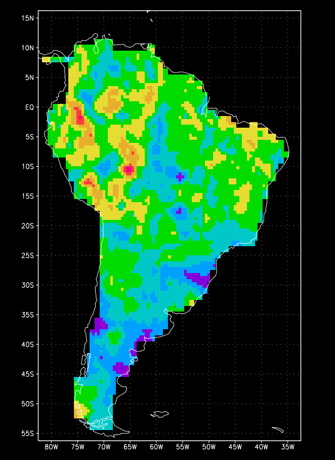
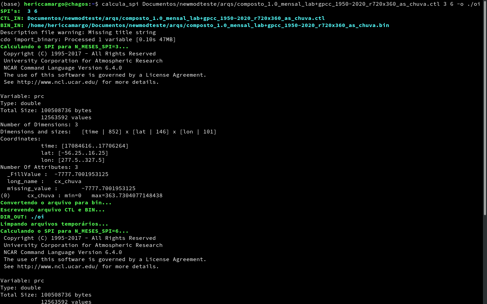

# Calcula SPI



**Implementado por Eduardo Machado**  
**Ano: 2015**

**Alterações por:**
- **Heric Camargo**  

Este conjunto de programas calcula o **Standardized Precipitation Index (SPI)** a partir de uma série de dados de precipitação mensal, utilizando uma abordagem em etapas que inclui a conversão de formatos de dados e o cálculo do SPI com o uso de **NCL** (NCAR Command Language).

## Visão Geral do Processo

O fluxo do programa é o seguinte:

1. **Entrada de Dados**: O programa recebe como entrada um arquivo de controle no formato `.ctl` ou `.nc`, que contém dados de precipitação mensal.
2. **Conversão para Formato NetCDF**: O script converte os dados de precipitação para o formato `.nc` usando **CDO** (Climate Data Operators) Caso o arquivo de entrada já esteja no formato `.nc`, ele será usado diretamente.
3. **Cálculo do SPI**: O cálculo do SPI é feito utilizando o script NCL (`calcula_spi.ncl`), que gera a saída em formato binário. (O script NCL foi ajustado para gerar a saída corretamente.)

~~4. **Conversão de Dados para Binário**: A saída gerada é convertida para o formato binário usando um script em **Python** (`converte_txt_bin.py`).~~

5. **Geração de Arquivo de Controle**: Um novo arquivo `.ctl` é gerado, com as variáveis ajustadas para o cálculo do SPI.

## Requisitos

- **NCL** (NCAR Command Language) instalado no sistema.
- **CDO** (Climate Data Operators) para conversão de formatos de dados.
- **NCDump** para visualização de arquivos NetCDF.

## Como Usar

1. **Configuração Inicial**:
   - Certifique-se de que todas as dependências (NCL, CDO, NCDump) estão instaladas e configuradas no sistema.

2. **Execução**:
   No terminal, execute o comando:

   ```bash
   ./calcula_spi.sh [ARQUIVO ENTRADA] [N_MESES_SPI...] [--var VARIABLE] [--out PREFIXO_DE_SAIDA] [--silent]
   ```

   > **Atenção**: Este script deve ser executado na **Chagos**. Ele não funciona na minha máquina local.

   Substitua:
   - `[ARQUIVO ENTRADA]` pelo caminho do arquivo que contém os dados de precipitação.
   - `[N_MESES_SPI...]` (opcional) pelos números de meses a serem usados para o cálculo do SPI (ex: 3 6 9 12).
   - `--var VARIABLE` (opcional) para especificar a variável a ser processada (padrão é `cxc` ou `precip` ou `pr`).
   - `--out PREFIXO_DE_SAIDA` (opcional) para especificar o prefixo do diretório de saída (padrão é `saida_`).

   O script vai realizar as seguintes etapas:
   - **Conversão**: O arquivo de entrada será convertido para `.nc` se necessário.
   - **Cálculo do SPI**: O cálculo do SPI será realizado para cada número de meses especificado.
   - **Arquivo de Controle**: Um novo arquivo `.ctl` será gerado, ajustando a variável especificada para `spi[index]`.
   - **Saída**: Os arquivos de saída serão gerados no diretório de saída especificado.

3. **Ajuda**:
   Para ver as opções de ajuda, execute:

   ```bash
   ./calcula_spi.sh --help
   ```

   **Exemplo de saída:**

   ```
   Uso: ./calcula_spi.sh [Arq .ctl ou .nc] [Nº de meses...] [--var VARIABLE] [--out PREFIX] [-s]
      Esse script calcula o SPI a partir de um arquivo .ctl ou .nc
      O script gera um arquivo .bin e um arquivo .ctl com a variável 'spi'
   ATENÇÃO! Rode na Chagos. Na minha máquina local não funciona.
   Opções:
   -h, --help			Mostra essa mensagem de ajuda e sai
   --var VARIABLE, -v VARIABLE	(Opcional) Especifica a variável a ser processada (padrão 'cxc' ou 'precip' ou 'pr')
   --out DIR, -o DIR		(Opcional) Especifica o diretório de saída (padrão: diretório atual com sufixo '_spi')
   -s, --silent			(Recomendado) Modo silencioso - reduz a saída de mensagens
   -w, --workers NUM		(Opcional) Número máximo de processos paralelos (padrão: 4)
   Nota:
   Se não especificar os meses, serão usados: 1 3 6 9 12 24 48 60
   Exemplo:
   ./calcula_spi.sh ./arquivos/precipitacao.ctl 3 6 9 12 --var precip --out resultado_ -s
   ```

4. **Arquivos Gerados**:
   - **Saída**: Os arquivos `.ctl` e `.bin` contendo os resultados do Calculo SPI serão gerados no diretório de saída especificado. Caso não especificado, no diretório onde foi chamado o script, com o prefixo `saida_`.
   - **Arquivo de Controle**: Arquivos `.ctl` ajustados serão gerados, com a variável `spi[index]` no lugar da variável especificada.

5. **Diretórios de Entrada e Saída**:
   - O programa cria um diretório de saída chamado `[nome_arquivo][sufixo]` dentro do diretório de entrada para armazenar os arquivos gerados.
     - O sufixo de saída padrão é `_spi`, mas pode ser alterado com a opção `--out`.

## Detalhes de Implementação

- O script principal `calcula_spi.sh` é responsável pela execução do fluxo de trabalho, incluindo a verificação dos parâmetros de entrada, conversão de dados, e execução do cálculo do SPI.
- O script NCL (`calcula_spi.ncl`) foi ajustado para utilizar a variável especificada e processar os dados conforme necessário.
- O script NCL (`resumo_spi.ncl`) mostra um resumo das variáveis do arquivo antes do calculo do SPI.

### Observações

- O script agora permite calcular múltiplos SPIs em uma única execução, especificando vários números de meses após o arquivo `.ctl`.
- O script lida corretamente com nomes de arquivos que possuem caracteres especiais ou que têm apenas um caractere.
- As substituições no arquivo `.ctl` são feitas de forma segura, evitando alterações indesejadas em outras partes do arquivo.
- O nome do arquivo de entrada (`.ctl`) não precisa mais ter pelo menos dois caracteres.

## Exemplo de Execução para Vários Meses

```bash
./calcula_spi.sh /dados/entrada/precipitacao.ctl 3 6 9 12 
```

Nesse exemplo:
- O script irá calcular o SPI para os períodos de 3, 6, 9 e 12 meses.
- Os resultados serão salvos no diretório `precipitacao_spi` dentro do diretório de entrada.

Execução padrão:

```bash
./calcula_spi.sh /dados/entrada/precipitacao.ctl
```

- O script irá calcular o SPI para os períodos padrão de 1, 3, 6, 9, 12, 24, 48 e 60 meses.
- Os resultados serão salvos no diretório `precipitacao_spi` dentro do diretório de entrada.
- Dentro do arquivo `.ctl` gerado, a variável será substituída por `spi[index]`.
- O titulo terá o prefixo "SPI[meses] do ". adicionado.



## Melhorias Futuras

1. A leitura agora é feita de forma robusta, evitando problemas com arquivos `.ctl` que contenham palavras-chave ou variáveis com nomes semelhantes ao nome do arquivo. (Corrigido!)
2. O programa permite especificar a variável a ser processada com a opção `--var VARIABLE`, não estando mais limitado à variável `cxc`. (Corrigido!)
3. Necessidade de adicionar aliases no `.bashrc` para funcionar.
4. Dependência do NCL, deveria estar dentro do src.
5. o NCL é EOL desde 2019, deveria ser substituído por outra coisa. (problema do técnico do futuro)